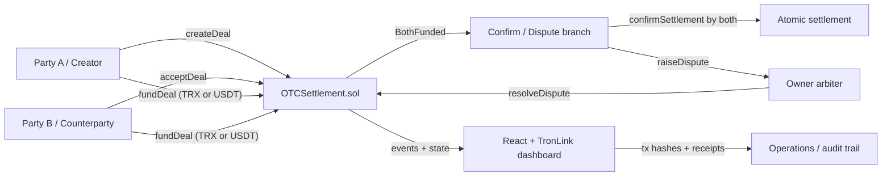

# Instant OTC Settlement Layer

A product-grade OTC escrow and settlement engine on TRON Nile that replaces trust-based chat settlement with verifiable on-chain escrow, atomic delivery, disputes, expiry handling, and downloadable receipts.

## Problem

OTC trades still lean on Telegram chats, screenshots, manual wire instructions, and counterparty trust. That creates three obvious failures:

- funds move before both sides are ready
- disputes require off-chain reconstruction
- there is no clean receipt trail for operations or compliance

## Solution

This app gives OTC desks a bilateral settlement layer:

- Party A creates a deal with exact assets, amounts, and a named counterparty
- Party B accepts the deal and both sides fund escrow
- both parties confirm settlement, triggering atomic release
- either side can dispute
- expired deals can be unwound on-chain
- the frontend maps every lifecycle transaction back into a receipt-quality UI

## Architecture



## Tech Stack

- Solidity smart contracts on TRON Nile
- TronBox + Hardhat tooling
- React + Vite frontend
- TronLink wallet integration
- TronWeb for blockchain reads and writes

## Repo Layout

- `contracts/contracts/OTCSettlement.sol`
- `contracts/test/OTCSettlement.test.js`
- `frontend/src/components/*`
- `frontend/src/hooks/useTronWeb.ts`
- `frontend/src/hooks/useContract.ts`
- `frontend/src/abi/OTCSettlement.json`

## Nile Deployment

- `OTCSettlement`: `TUe7qCsqrgRkEUTZUWdD57n1GicchDHBW2`

Saved in [`contracts/deployments/nile.json`](/Users/aaditjerfy/Documents/TRON_Payments_DeFi.py/contracts/deployments/nile.json)

## Setup

### 1. Clone and install

```bash
git clone <your-repo-url>
cd TRON_Payments_DeFi.py
```

```bash
cd contracts && npm install
cd ../frontend && npm install
cd ../backend && npm install
```

### 2. Set up TronLink

1. Install TronLink browser extension
2. Switch to `Nile Testnet`
3. Create at least two wallets:
   - Party A
   - Party B

### 3. Get Nile tokens

- Faucet: [nileex.io/join/getJoinPage](https://nileex.io/join/getJoinPage)
- Request Nile TRX for both parties
- Request Nile USDT if you want to test TRX/USDT deals

### 4. Deploy contracts

Create `contracts/.env.nile`:

```bash
export PRIVATE_KEY_NILE=YOUR_NILE_DEPLOYER_PRIVATE_KEY
```

Deploy:

```bash
cd contracts
source .env.nile
npm run tronbox:migrate:nile
```

### 5. Configure frontend

`frontend/.env`

```bash
VITE_OTC_SETTLEMENT=TYkV7zAq6XgEPK9yMQ9UYvBiSvFxAgrY3w
VITE_USDT=TF6HCtac1NwF7sSSq3CvQr5ezhp4MnMoFA
VITE_FEE_LIMIT_SUN=120000000
```

### 6. Run frontend

```bash
cd frontend
npm run dev
```

Open `http://localhost:5173`.

## Demo Walkthrough

1. Connect TronLink on Nile
2. Party A creates a deal: for example `sell 100 USDT for 10 TRX`
3. Party B opens the same app, sees the deal, and accepts it
4. Each side funds escrow
5. Both sides confirm they are ready to settle
6. One final settlement transaction releases both assets atomically
7. The app shows:
   - final status
   - all tx hashes
   - downloadable settlement receipt

You can also demonstrate:

- dispute flow: raise dispute before confirmation
- expiry flow: let the timeout pass, then claim expiry
- cancel flow: creator cancels before acceptance

## Tests

Run:

```bash
cd contracts
npm test
```

Covered cases:

- happy path settlement
- expiry refunds
- dispute + resolution
- cancellation
- access control
- double-funding prevention
- reentrancy protection

## Future Improvements

- multi-sig or role-based dispute resolution
- partial fills
- order-book or RFQ layer for desk workflows
- server-side indexing and notification webhooks
- institutional API and CSV/export bundles
